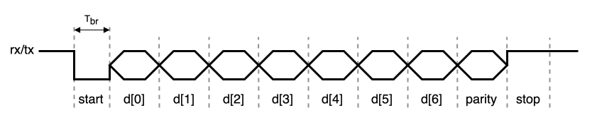

Requirements
============

External Interface Requirements
-------------------------------

.. list-table:: Control signals
  :header-rows: 1
  :width: 100%
  :widths: 10 10 10 70

  * - Name
    - Type
    - Width
    - Description

  * - clk_i
    - I
    - 1
    - Clock input.
  * - rst_i
    - I
    - 1
    - Hardware reset.

.. list-table:: Memory interface signals
  :header-rows: 1
  :width: 100%
  :widths: 10 10 10 70

  * - Name
    - Type
    - Width
    - Description

  * - wb_adr_i
    - I
    - 32
    - The address output array is used to pass binary address.
  * - wb_dat_i
    - I
    - 32
    - The data input array is used to pass binary data.
  * - wb_dat_o
    - O
    - 32
    - The data output array is used to pass binary data.
  * - wb_sel_i
    - I
    - 4
    - The select output array indicates where valid data is expected on the wb_dat_i signal array during READ cycles, and where it is placed on the wb_dat_o signal array during WRITE cycles. Each individual select signal correlates to one of four active bytes on the 32-bit data port.
  * - wb_we_i
    - I
    - 1
    - The write enable output indicates whether the current local bus cycle is a READ or WRITE cycle. This signal is negated during READ cycles and is asserted during WRITE cycles.
  * - wb_stb_i
    - I
    - 1
    - The strobe output indicates a valid data transfer cycle. It is used to qualify various other signals on the interface.
  * - wb_ack_o
    - O
    - 1
    - The acknowledge input, when asserted, indicates the normal termination of a bus cycle.
  * - wb_cyc_i
    - I
    - 1
    - The cycle output, when asserted, indicates that a valid bus cycle is in progress. This signal is asserted for the duration of all bus cycles.
  * - wb_stall_o
    - O
    - 1
    - The stall input indicates that current slave is not able to accept the transfer in the transaction queue.

.. requirement:: I_MEMORY_INTERFACE_01
  :derivedfrom: U_MEMORY_INTERFACE_01

  Signals from table 3 shall be compliant with the Wishbone specification.

.. list-table:: Serial interface signals
  :header-rows: 1
  :width: 100%
  :widths: 10 10 10 70

  * - Name
    - Type
    - Width
    - Description

  * - uart_rx_i
    - I
    - 1
    - This signal is sampled by the peripheral to receive data
  * - uart_tx_o
    - O
    - 1
    - This signal is driven by the peripheral to send data

Functional Requirements
-----------------------

.. requirement:: F_RESET_01
   :derivedfrom: U_REGISTERS_01

   The registers shall all be reset to 0 when rst_i is asserted.

.. requirement:: F_RESET_02
   :derivedfrom: U_UART_01

   The uart_tx_o signal shall be asserted while rst_i is asserted.

Memory interface
^^^^^^^^^^^^^^^^

.. requirement:: F_REGISTERS_01
   :derivedfrom: U_REGISTERS_01, U_MEMORY_INTERFACE_01, U_BAUD_RATE_01, U_PARITY_BIT_01, U_DATA_SIZE_01, U_STOP_BIT_01

   The following registers shall be implemented and accessible through the wishbone memory interface.

.. list-table:: Memory Mapping and Registers
  :header-rows: 1
  :widths: 1 94 1 1 1 1
  
  * - Address Offset
    - Register name
    - Width (in bits)
    - Access
    - Reset value
    - Section/page

  * - 0000_0000h
    - Status register (UART_SR)
    - 32
    - R
    - 0000_0000h
    - :ref:`UART_SR <SPEC_UART_SR>`
  * - 0000_0004h
    - Control register (UART_CR)
    - 32
    - R/W
    - 0000_0000h
    - :ref:`UART_CR <SPEC_UART_CR>`
  * - 0000_0008h
    - Receive Data register (UART_RXDR)
    - 32
    - R
    - 0000_0000h
    - :ref:`UART_RXDR <SPEC_UART_RXDR>`
  * - 0000_000Ch
    - Transmit Data register (UART_TXDR)
    - 32
    - W
    - 0000_0000h
    - :ref:`UART_TXDR <SPEC_UART_TXDR>`

.. _SPEC_UART_SR:
.. include:: ../spec/content/uart_sr.rst

.. _SPEC_UART_CR:
.. include:: ../spec/content/uart_cr.rst

.. _SPEC_UART_RXDR:
.. include:: ../spec/content/uart_rxdr.rst

.. _SPEC_UART_TXDR:
.. include:: ../spec/content/uart_txdr.rst

.. requirement:: F_READ_01
   :derivedfrom: U_REGISTERS_01
  
   The UART_RXDR register shall be reset after being read and the RXNE field of UART_SR shall be deasserted.

.. requirement:: F_READ_02
   :derivedfrom: U_REGISTERS_01
  
   The following fields of UART_SR shall be reset after being read : PE, FE and RXOE.

.. requirement:: F_RESET_03
   :derivedfrom: U_REGISTERS_01

   Any change to UART_CR shall cancel both ongoing tranmissions and receptions.

Serial protocol
^^^^^^^^^^^^^^^

.. requirement:: F_UART_01
  :derivedfrom: U_UART_01, U_UART_02
   The following frame format shall be used to encode and decode transit/receive data.

.. requirement:: F_UART_02
   :derivedfrom: U_PARITY_BIT_01, U_DATA_SIZE_01, U_STOP_BIT_01

   The number of data bits, parity bits and stop bits shall match the configuration provided in UART_CR.

.. requirement:: F_UART_03
   :derivedfrom: U_BAUD_RATE_01

   The time Tbr shall be equal to the product of the CLK_DIV field of UART_CR with the period of clk_i.

.. requirement:: F_UART_04
   :derivedfrom: U_UART_03

   Parallel transmission/reception shall be supported.

Receive
^^^^^^^

.. requirement:: F_RECEIVE_01
   :derivedfrom: U_UART_02

   The peripheral shall sample the uart_rx_i signal with a sample interval defined in number of clk_i edges by the field CLK_DIV field of UART_CR.

.. requirement:: F_RECEIVE_02
   :derivedfrom: U_UART_02

   The peripheral shall set the value of the RXD field of UART_RXDR after latching the stop bit.

.. requirement:: F_RECEIVE_03
   :derivedfrom: U_UART_02

   The peripheral shall assert the RXNE field of UART_SR when setting the value of the RXD field.

.. requirement:: F_RECEIVE_ERROR_01
   :derivedfrom: U_UART_04

   The peripheral shall assert the PE field of UART_SR when the result of the xor of all the received bits is not equal to the received parity bit.

.. requirement:: F_RECEIVE_ERROR_02
   :derivedfrom: U_UART_05

   The peripheral shall assert the FE field of UART_SR when the received stop bit is zero instead of one.

.. requirement:: F_RECEIVE_ERROR_03
   :derivedfrom: U_UART_06

   The peripheral shall assert the RXOE field of UART_SR after latching the stop bit while the RXNE field of UART_SR is asserted.

Transmit
^^^^^^^^

.. requirement:: F_TRANSMIT_01
   :derivedfrom: U_UART_01

   The peripheral shall transmit the TXD field of UART_TXDR after a write to UART_TXDR when the TXE field of UART_SR is deasserted, with a sample interval defined in number of clk_i edges by the field CLK_DIV field of UART_CR.

Non-functional Requirements
---------------------------

N/A
